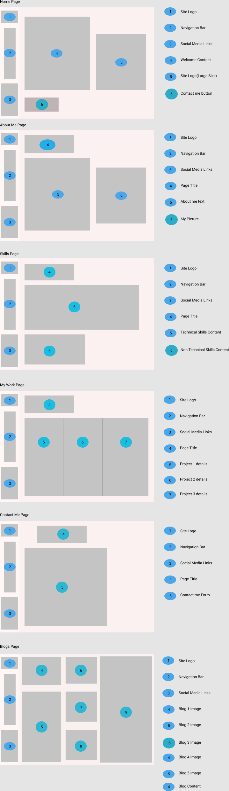
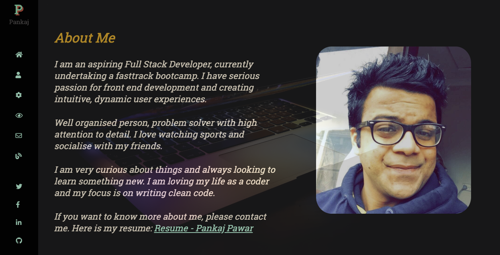
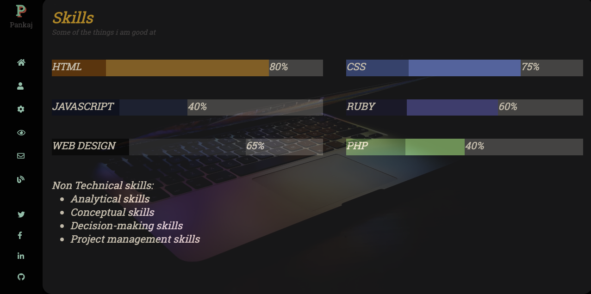
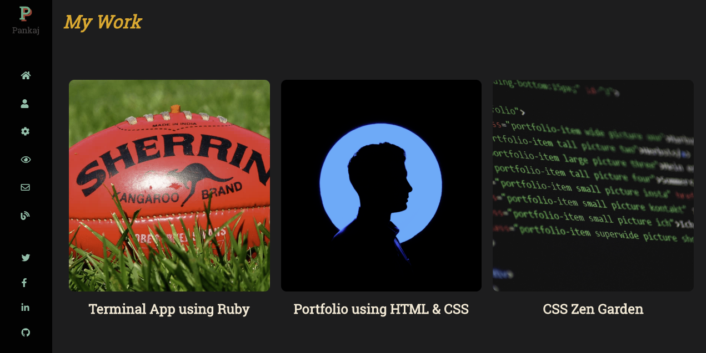
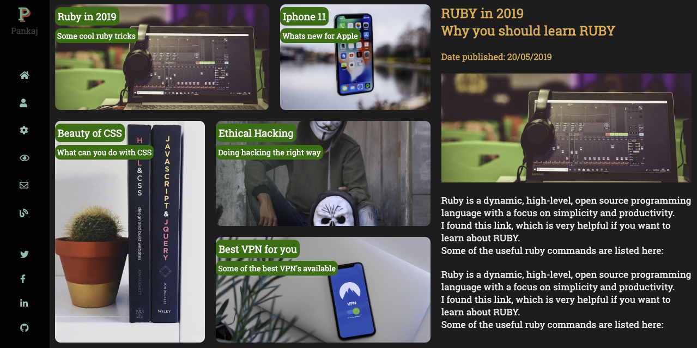
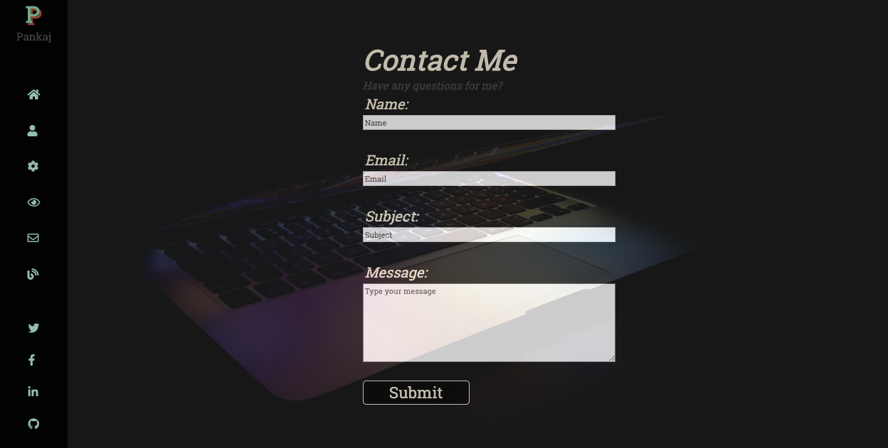

# Portfolio Website

## Pankaj Pawar | Full Stack Developer

## Live Preview: [Portfolio Website](https://pankaj-pawar.netlify.com/)

## Github Repository: [Github Repo](https://github.com/pankajpawar2/My-Portfolio)

# Table of Contents

  * Purpose
  * Target audience
  * Functionality / features
  * Sitemap
  * Site Tour

## Purpose

The portfolio website provides a brief overview about me. The portfolio will help showcase my skills to recruiters, as well as providing information about my past projects and work experience.
This will help recruiters make a decision about my suitability for a role.
The purpose is to provide an online website for anyone to understand my personality and background. The portfolio is created using HTML and CSS skills.

## Target audience

This portfolio is mainly intended for recruiters to check my suitability for a web development role. Also, this website is for anyone who wants to see my work and my personal skills.

## Features

The main focus when creating this portfolio website was simplicity and ease-of-use.
The navigation bar, main content and footer are designed in a way, that it gives consistent feel of the website.
The website is made up of different components:

1. Landing Page/Home Page:

The landing page, which is the home page of the website, has navigation bar on the left side. The navigation bar has links to different pages of the website. On the home page, there is a footer section at the bottom left, which has links to social media profiles as well as github.
The main content is to the right of the navigation bar and it displays content specific to a page.
This layout is consistent throughout the website

2. About Me

The About me page provides information about my personality, including my hobbies as well as a link to my professional resume. It also includes a picture of me.

3. Skills

Skills page showcases various technical and non-technical skills i possess. 

4. My Work

 This page displays different projects i have worked and also a github link to view those projects in detail.

5. Contact Me

Contact Me page allows anyone to contact me using a form.

6. Blogs

This page has links to various blogs i have created. Each blog has an image and date published as part of its content.

## Sitemap

Below is a sitemap for my portfolio website.

## Wireframes

## Site Tour

Below is visual representation of all the pages of my portfolio.

1. Landing Page:

2. About Me Page:

3. Skills Page

4. My Work Page

5. Blogs Page

6. Contact Me page

## Tech Stack

1. HTML

2. CSS

3. Netlify to deploy website

4. Formspree

Some useful links:

[Google Fonts](https://fonts.google.com/)

[Font Awesome](https://fontawesome.com)

[Using Figma for creating Wireframes](https://www.figma.com/)

[Background Images](https://unsplash.com/)

